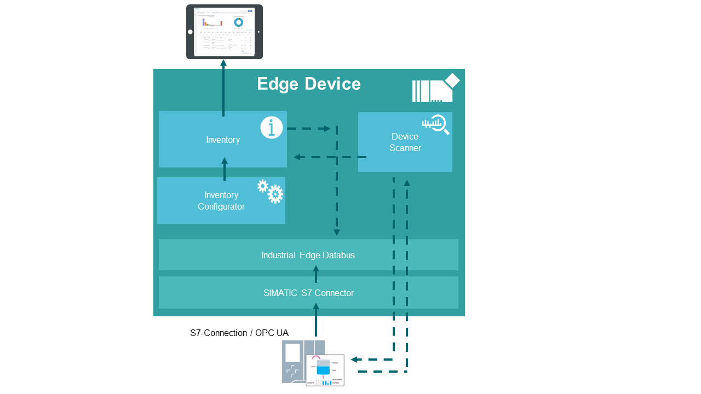

# Inventory application example

This example shows how to use the Industrial Edge App “Inventory” 

- [Inventory](#Inventory)
  - [Description](#description)
    - [Overview](#overview)
    - [General task](#general-task)
  - [Requirements](#requirements)
    - [Prerequisities](#prerequisities)
    - [Used components](#used-components)
  - [Configuration steps](#configuration-steps)
  - [Usage](#usage)
  - [Documentation](#documentation)
  - [Contribution](#contribution)
  - [Licence and Legal Information](#licence-and-legal-information)

## Description

### Overview

This document describes how to display important PLC data such as alarms or device status in Inventory.

### General task

The example scans the network and displays all participants with detailed information in the Inventory App.
In the Inventory Configurator, the network settings and the "whitelist" and "blacklist" for the desired firmware versions are configured.
By scanning in the Inventory App, all devices that are found can be displayed.
All important device information and firmware versions are displayed in detail. 

## Requirements

###  Prerequisities

- Access to an Industrial Edge Management System (IEM)
- Onboarded Industial Edge Device on IEM
- Installed Apps Device Scanner, Inventory Configurator and Inventory
- Edge device is connected to PLC
- Google Chrome (Version ≥ 72) or Firefox (Version ≥ 62)

### Used components

- Industrial Edge Management (IEM) V1.1.0-46
- Device Scanner 1.1.0
- Inventory Configuratior 1.1.0
- Inventory 1.1.0
- Industrial Edge Device V 1.1.0-54
- S7-1511 or Third Party PLC (Rockwell)
- Web browser (Mozilla or Chrome)

## Configuration steps

You can find the further information about the following steps in the [docs](docs/Installation.md)
- Configure Inventory Configurator and Inventory

## Usage

Once the Inventory Configurator App is configured, identification and maintenance data (I&M data) and devices scanned from the network can be visibly displayed in the Inventory App.

## Documentation

You can find further documentation and help in the following links
  - [Industrial Edge Hub](https://iehub.eu1.edge.siemens.cloud/#/documentation)
  - [Industrial Edge Forum](https://www.siemens.com/industrial-edge-forum)
  - [Industrial Edge landing page](https://new.siemens.com/global/en/products/automation/topic-areas/industrial-edge/simatic-edge.html)
  
## Contribution

Thank you for your interest in contributing. Anybody is free to report bugs, unclear documentation, and other problems regarding this repository in the Issues section.
Additionally everybody is free to propose any changes to this repository using Pull Requests.

If you are interested in contributing via Pull Request, please check the [Contribution License Agreement](Siemens_CLA_1.1.pdf) and forward a signed copy to [industrialedge.industry@siemens.com](mailto:industrialedge.industry@siemens.com?subject=CLA%20Agreement%20Industrial-Edge).

## Licence and Legal Information

Please read the [Legal information](LICENSE.md).
